# The autonomy editor: a user guide

> **This guide is for TrainControl v3.0.0 and newer.**  Using v2.8.2 or older?  Autonomy worked differently then - a graph built in the Autonomy tab or written in JSON - and **[the guide for those versions](AutomationAPI.md)** describes it.  That guide also covers driving TrainControl from Java, which still works in v3.0.0.

This guide takes you from a track diagram with nothing set up on it to a layout running trains on its own. Everything is done in the **autonomy editor**, on the track diagram itself: there is no file to write and no code to run. The first half is the editor - how to open it, what is on screen, and what each menu and tool does. The second half is worked examples, and what to do when trains will not move.

**Contents**

- [What you need](#what-you-need)
- [The idea in one page](#the-idea-in-one-page)
- [Getting started](#getting-started)
- [Setting up your railway](#setting-up-your-railway)
- [The editor at a glance](#the-editor-at-a-glance)
- [Saving, cancelling, and changing page](#saving-cancelling-and-changing-page)
- [Clicking a square: which way trains may run](#clicking-a-square-which-way-trains-may-run)
- [The right-click menu](#the-right-click-menu)
- [Bulk Tools](#bulk-tools)
- [The tools: Test a path, Why not Moving?, One-Way Run](#the-tools-test-a-path-why-not-moving-one-way-run)
- [Keyboard shortcuts](#keyboard-shortcuts)
- [The setup check](#the-setup-check)
- [Example 1: a shuttle between two stations](#example-1-a-shuttle-between-two-stations)
- [Example 2: an oval with a passing loop](#example-2-an-oval-with-a-passing-loop)
- [Example 3: a terminus, and trains that must turn round](#example-3-a-terminus-and-trains-that-must-turn-round)
- [Example 4: a through station that only takes trains one way](#example-4-a-through-station-that-only-takes-trains-one-way)
- [Track lengths: what they are for](#track-lengths-what-they-are-for)
- [Running and watching](#running-and-watching)
- [Choosing how trains pick their route](#choosing-how-trains-pick-their-route)
- [Timetables: recording a sequence and playing it back](#timetables-recording-a-sequence-and-playing-it-back)
- [Sending everything home](#sending-everything-home)
- [Settings, and what each one is for](#settings-and-what-each-one-is-for)
- [Configurations: what each one keeps, and what they share](#configurations-what-each-one-keeps-and-what-they-share)
- [When trains will not move](#when-trains-will-not-move)

---

## What you need

**S88 feedback sensors - required.** TrainControl knows where a train is because a sensor told it, so autonomy cannot run without them. Every station needs at least one S88 contact. Three is much better — before the stopping point, at it, and after it — because that is what lets a train slow down as it arrives rather than stopping dead on the contact.

**Digital switches where routes divide - required.** Autonomy sets every switch along a train's route before the train sets off, so the switches your trains run through need a decoder and an address TrainControl can set. A switch on the diagram with no address is listed under `Must be fixed` in the [setup check](#the-setup-check), and autonomy will not start until it has one.

**Digital signals - optional.** Autonomy does not need signals: it brings each train to a smooth stop on its own sensors. Where you have them, TrainControl sets the signals on a route to green along with its switches. It sets a signal back to red only where you pair it with a station - `Exit Guard Signal...` holds it red while a train stands there, and `Entry Guard Signal...` turns it red when a train arrives. A signal you do not pair stays green. Guard signals look right, and add a layer of safety; a station without one is only listed under `Worth tidying`.

**Switches you throw by hand, and signals that are only scenery.** Draw a hand-thrown switch with one of the track editor's *(Static)* switch tiles: autonomy then runs trains through it only from its legs towards the points, where the blades' position does not matter. Two `Y Switch (Static)` tiles drawn point to point count as a diagonal crossing. Any other switch, and any signal, on a page autonomy uses needs its address. A scissor switch cannot be used, and trains are not run across a turntable. Leave out a page that is only a picture (`Exclude Page`).

**A track diagram stored on this computer.** Either downloaded from your Central Station with **Layouts → Download Central Station Layout Files**, or drawn in TrainControl's own editor. A diagram read from the Central Station each time TrainControl starts cannot carry an autonomy setup, so download it first - the Autonomy menu offers to. Automation is set up on this diagram, so if your diagram does not yet match your railway, start there.

**Locomotives with addresses that work.** If you cannot drive a locomotive by hand from TrainControl, automation will not be able to either.

That is all. You do not need to describe your track anywhere: TrainControl reads the diagram and works out for itself which squares connect to which.

---

## The idea in one page

Automation rests on three things, and everything else in this guide is a refinement of one of them.

**Stations are where trains stop.** You do not create them: every sensor square on your diagram can become a station, because a sensor is exactly the thing that can tell TrainControl a train has arrived. What you do is give them names, and say which ones trains may actually stop at as opposed to merely pass through.

**The track says where a train may go.** TrainControl traces the track on your diagram and works out the connections by itself. You do not draw them. What you do is close the few pieces of track you do not want used — a siding you would rather trains kept out of, or a line that only makes sense in one direction.

**A locomotive has to be somewhere to start.** You tell TrainControl which train is standing at which station. From then on it keeps track by itself.

Press start, and TrainControl picks a train, picks somewhere it can go, sets the switches and signals along the way, sends it, and watches the sensors until it arrives. Then it does it again.

The pictures in this guide are of a small demo layout: an oval with stations Ashby and Bramley, a passing loop with Carlton, and a branch to a terminus, Thornbury. The numbers on them are the steps below, and the letters the steps of [Example 1](#example-1-a-shuttle-between-two-stations).

---

## Getting started

**1. Make a configuration.** `Autonomy` → `Add a Configuration...`. TrainControl asks for a name (the first is "Autonomy 1"), reads your track diagram as it stands, and loads the result. Every sensor can now be a station, and the track between them is what trains will use. A configuration is one way of running your railway; you can have several (see [Configurations](#configurations-what-each-one-keeps-and-what-they-share)).

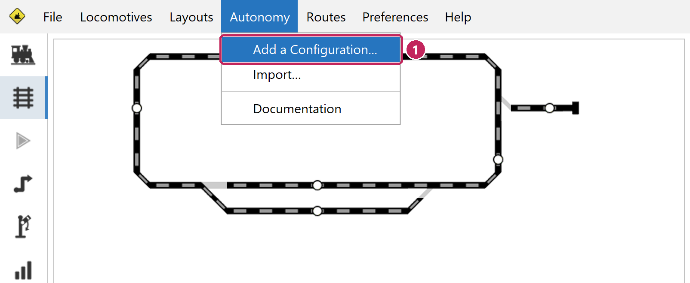

**2. Open the editor.** `Autonomy` → `Edit Autonomy on Page`, and pick your page. Other ways in:

- **The strip above the track diagram.** When the setup has something to fix it shows a count - "2 errors, 1 warning - 1 on this page" - and a `Fix it` button in place of Start. Either opens the editor on the first thing to deal with.
- **Right-click a square on the track diagram** → `Autonomy Setup` → `Open the Full Editor...` opens the editor on that square.
- **Inside the editor**, the sidebar on the left switches between `Track Diagram` and `Autonomy Setup`, and between pages.
- The Auto tab's Settings has `Edit Autonomy Paths in Track Diagram`, which opens the autonomy editor.
- The diagram's `Edit` button and `Layouts` → `Edit Layout Page` open whichever editor you used last - the track diagram or the autonomy setup.

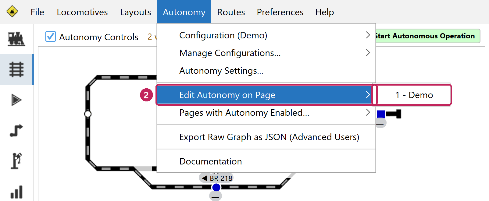

Only one editor window is open at a time; any of these while it is open simply brings it forward. The editor cannot be opened while autonomy is running - stop the trains first. While it is open, the Autonomy menu is greyed except for `Documentation` and an `Open the Full Editor...` that brings it forward, and no train can be sent.

---

## Setting up your railway

A layout is ready to run once three things are done: the diagram matches the track, the places trains should stop are stations, and the trains and track are measured. The rest is optional. Work in this order - each step relies on the one before.

**3. Make the track diagram match your railway.** Autonomy knows your track only from the diagram. Every switch and every crossing has to be on it, where it really is and joined up the way the track is, each switch with its real address; and each S88 contact on the square where it really sits, with its real address. A switch left off is a junction autonomy does not know about, a crossing left off lets it send two trains over the same diamond at once, and a sensor on the wrong square stops trains in the wrong place. Do this in the track diagram editor (`Editing` → `Track Diagram`) before anything else: the setup is read from it. If your track runs across pages or through tunnels, pair each page link and tunnel that track runs into: right-click it → `Pair with a Link...` and pick the link it leads to. An unpaired one is listed under `Must be fixed`. Untick `Autonomy Uses This Link` on any that are only part of the drawing.

**4. Make a station of each sensor where trains should stop.** A sensor is not a station until you say so. Right-click each one where you want trains to stop, choose `Station (...)` → `Yes - Trains Can Stop Here`, and name it with `Rename...` (Control+S); `Bulk Tools` → `Name Everything...` visits a page's unnamed sensors in turn. Leave the rest as they are - the sensors before and after a platform, and those that follow a train through a junction, are for passing. A station at the end of a line also needs `Changing Direction` → `Trains Must Change Direction Here` (see [Example 3](#example-3-a-terminus-and-trains-that-must-turn-round)).

**5. Measure your trains and your track.** Pick a unit and use it everywhere. `Bulk Tools` → `Mass Assign Train Lengths (... missing)...` asks for each train's length, and `Mass Assign Lengths...` for the track's, a stretch at a time; tick `Unmeasured Track` under `Visible Elements` to see what is left. Autonomy runs without lengths, but it cannot then tell whether a train fits a station or how much track a standing train covers, and it keeps each train's whole route reserved until it arrives. [Track lengths](#track-lengths-what-they-are-for) says what each number does, and what to measure first.

**6. Place your trains.** Right-click the station each train is standing at → `Add a Locomotive to Autonomy...`. From then on TrainControl keeps track of them.

**7. Check, save and start.** `Things to look at` lists anything still to do. When the line under it says the setup is ready to run, press `Save Changes`, then `Start Autonomous Operation` on the strip above the track diagram.

**Optional, when you want them:**

- **Guard signals.** On a station's right-click menu, `Exit Guard Signal...` holds signals at red while a train stands there or is on its way, and `Entry Guard Signal...` turns them red when a train arrives. They are for the look of it and an extra layer of safety: autonomy stops trains on their sensors either way.
- **Exclusions.** Keep trains off what they should not use: click track to make it one-way or close it (or `Trains May Depart...`); leave a whole page out with `Exclude Page`; take a station out of service with `Station (...)` → `No - Nothing Can Pass`; untick `Can Be Chosen in Full Autonomy` for a parking berth only you and Return Home will use; and keep particular trains away from a station with `Advanced Parameters...` → `Excluded Locomotives`.
- **Advanced parameters.** A station's `Advanced Parameters...` has `Station Priority`, `Speed Multiplier` and `Unavailable While Occupied`; `Station (...)` has its `Maximum Train Length`; and `Trains May Arrive...` says which sides it takes trains from. Settings for the whole railway - delays, speeds, how many trains run at once - are on the Auto tab: see [Settings](#settings-and-what-each-one-is-for).

---

## The editor at a glance

The window is titled "Autonomy Editor: *page*": the sidebar on the left, your diagram in the middle, and tools and settings on the right.

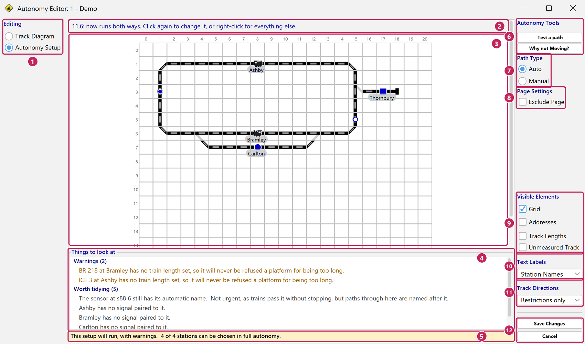

1. **`Editing`** - `Track Diagram` and `Autonomy Setup` switch between drawing track and setting up autonomy, on the same page. With two or more pages, a `Page` list above it goes from page to page.
2. **The message strip** says what just happened and what to do next.
3. **Your diagram.** Click track to set which way trains may run; right-click any square for everything else. Hover over a station to see its name.
4. **Things to look at** lists what the [setup check](#the-setup-check) has found. Click a finding to go to its square.
5. **The line under it** says whether the setup is ready to run.
6. **`Autonomy Tools`** - `Test a path` and `Why not Moving?`; see [the tools](#the-tools-test-a-path-why-not-moving-one-way-run).
7. **`Path Type`** - `Auto` or `Manual`: whether those two tools answer for autonomy choosing a destination, or for a train you send yourself (and Return Home).
8. **`Page Settings`** - `Exclude Page` leaves this whole page out of autonomy: its sensors stop being stations and nothing on it is driven. Put it back from `Autonomy` → `Pages with Autonomy Enabled…`.
9. **`Visible Elements`** - `Grid` (Control+K), `Addresses` (Control+D), `Track Lengths` - each square's recorded length (Control+G) - and `Unmeasured Track`, the track with no length yet.
10. **`Text Labels`** - what the station captions show: `Station Names`, `Standing Locs` (the train standing there), `Home Locs` (the station's home locomotive), `None`, or `Labels Only` (your own diagram text instead). Control+L steps through them.
11. **`Track Directions`** - which direction marks are drawn: `Show All`, `Restrictions only` (just the directions you have shut - the usual one), `Allowed only` (just the directions trains may run), `Hide All`, or `Station Arrivals` (which sides each station takes trains from).
12. **`Save Changes`** and **`Cancel`** - see [Saving, cancelling, and changing page](#saving-cancelling-and-changing-page).

The visibility settings are remembered between openings.

---

## Saving, cancelling, and changing page

**Changes take effect as you make them.** With a configuration loaded, the railway is rebuilt behind each change, so Test a path and the diagram always show the setup as you have it. There is no undo; there is Cancel.

**`Save Changes`** writes the setup and closes the editor. Errors in the setup do not stop you saving - you may be part way through - but a setup with errors cannot run. If the saved setup cannot even be built (a page link left unpaired, say), the railway keeps the last setup that worked, and the strip above the diagram says **Setup changes not applied yet** until the setup builds again.

**`Cancel`**, Escape, or the window's close box throws away everything changed since the editor opened, after asking. With nothing changed it simply closes.

**Changing page or mode** with unsaved changes asks first: `Save and Continue`, `Discard and Continue`, or `Stay Here`. So does quitting TrainControl with the editor open. Clicking a finding on another page goes there without asking, and keeps what you have done so far.

**Changing the track diagram later.** If you change the track diagram, autonomy re-reads it. A square you move in the track diagram editor takes its station name, length and directions with it; a square you delete loses them, and TrainControl tells you which. Look at `Things to look at` again after any diagram change. The setup is kept in the layout folder, under `config/autonomy`, beside the diagram's own pages, so back up the whole layout folder, or use File → Backup TrainControl Data.

---

## Clicking a square: which way trains may run

With no tool armed, a left-click on track changes which way trains may run on it, and the message strip says what it is now.

- **Plain track**: each click changes the whole run of plain track between two switches or sensors - both ways, one way, the other way, closed, and back to both ways.
- **A switch, crossing or double curve**: each click steps to the next combination of open arms, the common ones first - all open, each route on its own, closed, then the rest. The arms can also be ticked one by one from the right-click menu.
- **A page link or tunnel** has no direction of its own: set the track leading up to it.

**Shift+click** picks several squares (outlined in orange) so that one `Segment Length...` can give them all the same length. **Drag a station's caption** to move it to another free square.

---

## The right-click menu

Right-click any square for everything else. The menu opens with the square's name or kind as a heading, and offers only what makes sense there. Settings on plain track act on the whole run. Nothing in it can be changed while autonomy is busy.

### On a sensor or a station

| Item | What it does |
| --- | --- |
| `Add a Locomotive to Autonomy...` | Says which train is standing here. One already in autonomy is moved here from wherever it was |
| `Place Locomotive...` / `Edit Locomotive...` | The train here and its details: reversible, arrival and departure functions, speed, train length, and the side it came in from |
| `Remove` *train* `from This Square` | Takes the train off this square |
| *train* `Is Facing...` | Which way the train here is facing. If you are not sure, leave it: autonomy corrects it the first time the train runs. Where it matters, also the side its tail lies, and which sensor behind it the tail has crossed - `Pick on the diagram...` lets you click it |
| `Set Home Locomotive...` | The train that belongs here: Return Home sends it back to this station (Control+H) |
| `Rename...` | The station's name - what you will see in every list and log line. Name them the way you talk about them (Control+S) |
| `Station (...)` | Whether trains may stop here: `Yes - Trains Can Stop Here`, `No - Trains Can Only Pass Through`, or `No - Nothing Can Pass` (out of service; a train already on it can still be driven off). Also `Can Be Chosen in Full Autonomy` - untick it for a parking berth that only trains you send, and Return Home, will use - and `Maximum Train Length` (Control+B). The label shows the current answer, e.g. "Station (yes)"; a star means autonomy will not choose it |
| `Changing Direction` | `Trains Never Change Direction Here`, `Trains May Change Direction Here` (stop, reverse and carry on - to reach a siding behind it, say), or `Trains Must Change Direction Here` (every train turns round - a terminus, or a berth trains back into) |
| `Trains May Arrive...` | Which sides of the station a train may arrive from and stop. Passing through is not affected. See [Example 4](#example-4-a-through-station-that-only-takes-trains-one-way) |
| `Trains May Depart...` | Which ways trains may leave this square: see the track items below |
| `Exit Guard Signal...` | Signals held at red while a train is standing at this station, or on its way, and set green again once it is free. Pick each by clicking it on the diagram, or by typing its address |
| `Entry Guard Signal...` | Signals set to red when a train arrives here at the end of its journey; the next route that needs them sets them green again |
| `Advanced Parameters...` | `Station Priority` (higher is chosen first; 0 is the default), `Speed Multiplier` (trains run at this percentage of their speed on the track leading in to this station), `Excluded Locomotives` (trains that may not stop here), and `Unavailable While Occupied` (other stations that, while occupied, keep trains away from this one - tick them, or `Pick on the Diagram...`) |
| `Segment Length...` | How long this piece of track counts as, in your own units - see [Track lengths](#track-lengths-what-they-are-for) (Control+E) |
| `Show a Station Name Here...` | Puts a station's caption on this square (Control+N). `Stop Showing` *station* takes it off |
| `Bulk Tools` | See [Bulk Tools](#bulk-tools) |

### On track, switches and signals

- **`Trains May Depart...`** - on plain track and signals: `Both Ways`, `One Way, Toward` *a compass point*, or `Closed - No Trains`. On a switch or crossing: tick each side trains may leave by (`The N Side` and so on), set each branch on its own (`Branch E to W`...), or open or close `Every Branch of This Switch` at once.
- **`Segment Length...`**, and on plain track and crossings the caption items, `Show a Station Name Here...`.

Names cannot sit on switches or signals.

### On a page link or tunnel

| Item | What it does |
| --- | --- |
| `Autonomy Uses This Link` | On by default. Untick it for a link that is only part of the drawing: it then carries no trains, is greyed on the diagram, and is not reported as unpaired |
| `Pair with a Link...` | Which link this one leads to - links on other pages are listed too, and each flashes on the diagram as you go through the list. Page links pair with page links, tunnels with tunnels on the same page |
| `Go to the Other End (...)...`, `Unpair This Link` | Once it is paired |
| `Name...`, `Segment Length...` | The link's name, and the length of track it stands for |

### On text and empty squares

`Show a Station Name Here...` puts a station's caption here; over your own text it asks first.

---

## Bulk Tools

The last item of every right-click menu: things that act on the whole setup rather than one square.

| Item | What it does |
| --- | --- |
| `One-Way Run` | Arms a tool that closes a run of track to one direction - see [the tools](#the-tools-test-a-path-why-not-moving-one-way-run) |
| `Name Everything...` | Visits each unnamed sensor on this page in turn and asks for its name (`Skip` moves on) |
| `Mass Assign Lengths...` | Walks each stretch of track on this page with no length, then asks one length for all its switches and one for all its crossings |
| `Mass Assign Station Max Train Lengths...` | Walks each station on this page with no maximum train length |
| `Mass Assign Train Lengths (... missing)...` | Walks each train autonomy would run that has no length of its own. The length is saved on the locomotive itself |
| `Clear All Locomotives`, `Clear All Home Locomotives` | Takes every train off, or forgets every home - Cancel puts them back |
| `Clear All Track Lengths`, `Clear All Station Max Train Lengths` | Starts the measurements over, on every page |
| `Allow Every Path` | Opens every one-way or closed piece of track both ways, on every page - Cancel puts them back. Track that can only ever run one way stays as it is |
| `Home All Trains Where They Stand` | Makes each train's present station its home |

Each "Clear" asks first, and says how many it would clear.

---

## The tools: Test a path, Why not Moving?, One-Way Run

A tool stays armed until you press its button again, press Escape, or right-click.

**`Test a path`** answers "could a train get from here to there?" Click the sensor a train would start from, then the sensor it should reach. The route there is drawn in yellow and the route back in amber - a leg ending at a station autonomy will not choose is drawn in magenta - and the message strip says how many routes there are each way, or "no way through". `Path Type` says whether to answer for autonomy (`Auto`) or for a train you send yourself (`Manual`); changing it redraws the last test. It uses the setup as you have it, unsaved changes included.

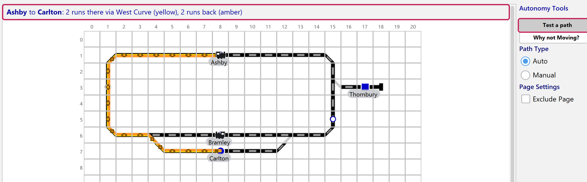

**`Why not Moving?`** answers "why is this train not being sent anywhere?" Click the square a train is standing on: every route it *could* take is drawn on the track, and the stations it cannot go to are listed underneath with the reason for each - occupied and by whom, switched off, excluded, too short, no track at all. A train with somewhere to go draws lines; a train with nowhere draws none. This tool reads the configuration as last **saved**: if you have unsaved changes it says so.

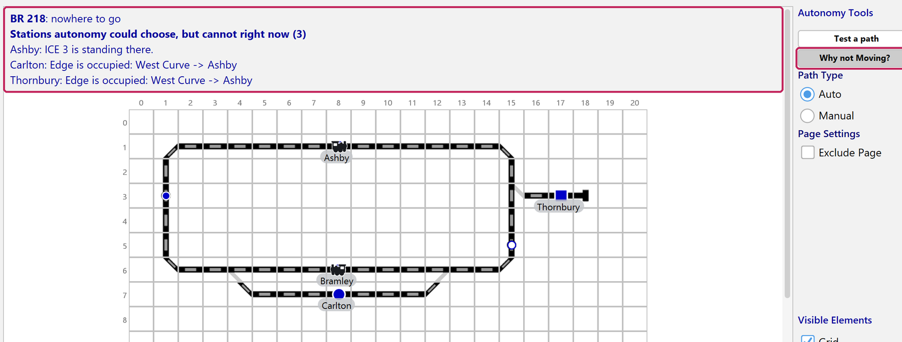

**`One-Way Run`** (from `Bulk Tools`) closes a stretch of track to one direction in two clicks: click one end of the run, then the far end, and choose `From A to B` or `From B to A`. It stays armed for the next pair.

---

## Keyboard shortcuts

These act on the square under the pointer.

| Keys | What they do |
| --- | --- |
| Control+S | Rename... |
| Control+E | Segment Length... (every picked square, with a Shift+click selection) |
| Control+N | Show a Station Name Here... |
| Control+B | The station's Maximum Train Length |
| Control+H | The station's home locomotive |
| Control+G | Show or hide Track Lengths |
| Control+L | Step through the Text Labels choices |
| Control+D | Show or hide Addresses |
| Control+K | Show or hide the Grid |
| + and - | Next and previous page |
| Shift+click | Pick a square, or let it go |
| Escape | Put down an armed tool; with nothing armed, the same as Cancel |

Copy, paste, rotate, delete and undo belong to the track editor, and do nothing here.

---

## The setup check

The setup is checked as you go, and everything it finds is listed under **Things to look at** at the bottom of the editor - this page first, then the others, each marked with its page. Click a finding to go to the square it is about.

- **`Must be fixed`** (red): errors. While the setup has any, autonomy will not start, and no train can be sent - by Start, Execute Timetable, Return Home, or by hand. Among them: a station still with its automatic name, or shown nowhere on the diagram; the same locomotive on two squares; two pages sharing one sensor; a page link that track runs into but that is not paired; a switch with no address; a train facing a way its square no longer allows (turn it with *train* `Is Facing...`, move it, or put the track back); and a station at the end of a line where trains may not change direction (mark it `Trains Must Change Direction Here`, or make it no station).
- **`Warnings`** (amber): worth knowing, but they stop nothing - a train facing track that runs only towards it is simply not sent that way; a station no other station can reach; a train or station with no length while others have one.
- **`Worth tidying`** (grey): small things, such as an unnamed sensor that is not a station, or a station with no guard signal.

The line under the list says where you stand: "This setup is ready to run", "This setup will run, with warnings", or how many things must be fixed first. It also says how many of your stations autonomy can choose.

Outside the editor, the strip above the track diagram shows the same count; click it, or `Fix it`, to open the editor on the first one.

---

## Example 1: a shuttle between two stations

The simplest arrangement that runs: two stations, one train, one piece of track between them.

```
    [ A ]=========================[ B ]
      s88 1                        s88 2
```

**Steps 1 and 2** - make the configuration and open the editor - are in [Getting started](#getting-started).

**A. Name the two stations.** Right-click each of the sensor squares at A and B and choose `Rename...`. The name is what you will see in every list and every log line, and what an arrival is announced under.

**B. Make both of them stations.** The same menu has `Station (...)`: choose `Yes - Trains Can Stop Here`. A sensor is not a station until you do; sensors that are only there to track a train through a junction stay `No - Trains Can Only Pass Through`.

**C. Put the train somewhere.** Right-click Station A and use `Add a Locomotive to Autonomy...`. This is a statement of fact about your railway: the train really does need to be standing at A.

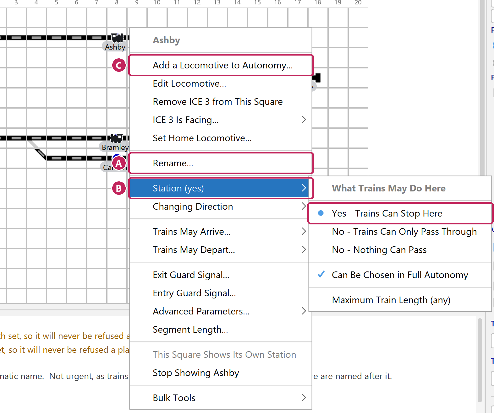

**D. Save.** `Save Changes`, at the bottom of the editor's right-hand column.

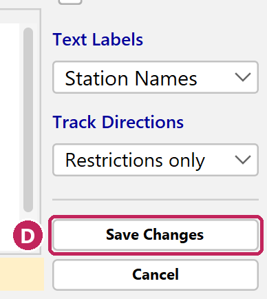

**E. Start.** `Start Autonomous Operation`, on the strip above the track diagram. The train runs to B. When it arrives, TrainControl notices, waits a moment, and runs it back to A. It will keep doing that.

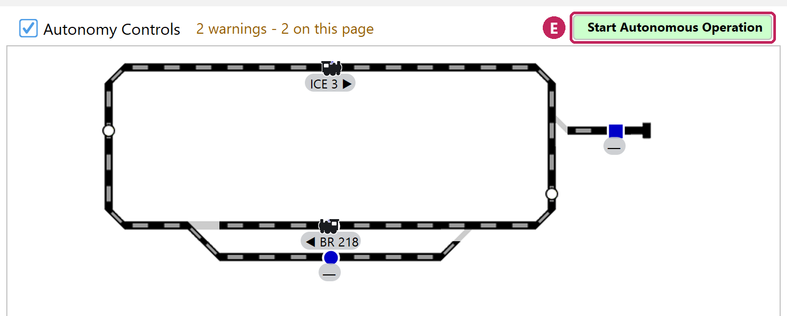

**What just happened.** TrainControl traced your diagram, found that A connects to B, saw a train at A, and found exactly one place it could go. Nothing else was needed.

**Try this.** Stop autonomy, and place a second locomotive at B. Start again. Now neither train can move — each wants the station the other is standing on, and a station holds one train at a time. This is the single most common reason a layout does nothing, and [it has its own section below](#when-trains-will-not-move).

---

## Example 2: an oval with a passing loop

Two trains, three stations, and the first arrangement where TrainControl has a choice to make.

```
              ___________[ C ]___________
             /                           \
    [ A ]===<                             >===[ B ]
             \___________________________/
```

Name the three sensor squares and make them stations, as before, and place a train at A and a train at B.

Press start. A train leaves A. It can reach B two ways — through the loop past C, or round the other side — and TrainControl picks one. Meanwhile the train at B can leave too, because its route does not need the track the first train is on.

**What this example is really showing** is that TrainControl reserves the track a train needs, and only that track. Two trains run at once here because their routes do not overlap. If they did, the second would wait.

**Try this.** In the editor, click one side of the loop until the message strip says it is closed - or right-click it, `Trains May Depart...` → `Closed - No Trains`. Now every train goes past C. With `Track Directions` on `Restrictions only`, closed track is marked on the diagram, so you can see at a glance what is not being used.

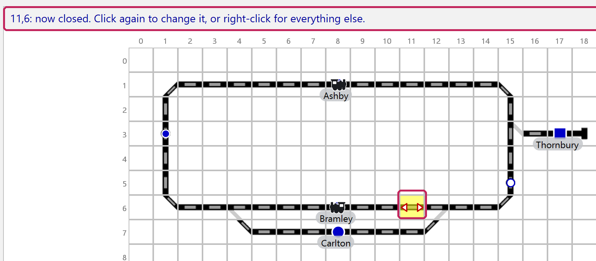

**Try this too.** Right-click C, open `Advanced Parameters...`, and set `Station Priority` higher than the others. Trains will now go to C whenever it is free and they have a clear route there; the other stations are chosen only when C is not available. (That holds under every routing rule except *Completely at Random*, which ignores priority, and *Weighing Station Priority Against Distance*, which treats it as a weight rather than a rule.)

---

## Example 3: a terminus, and trains that must turn round

A terminus is a station where the track stops. A train arriving must leave the way it came, which means reversing.

```
    [ A ]===========[ B ]===========[ T ]
                                      terminus
```

Name T as before, and then right-click it and choose `Changing Direction` → `Trains Must Change Direction Here`.

A station at the end of a line has to be marked this way: left unmarked, the setup check reports it as an error, because a train sent there could never leave.

This tells TrainControl two things. First, every train that arrives at T turns round before it leaves, so autonomy sends only locomotives that can reverse there (tick `Reversible` in `Place Locomotive...` / `Edit Locomotive...`). You cannot send one that cannot reverse there yourself either, unless T is a parking berth (below). Second, T is the end of the line: no train is routed through it on the way somewhere else.

Autonomy will choose T like any other station. If T is really a parking track or a shunting neck, where trains ending up at random would be chaos rather than operation, open `Station (...)` and untick `Can Be Chosen in Full Autonomy`. Autonomy then leaves it alone, but you can still send a train there yourself (right-click the train on the track diagram, and look under `More Destinations`), and [Return Home](#sending-everything-home) will still park trains there.

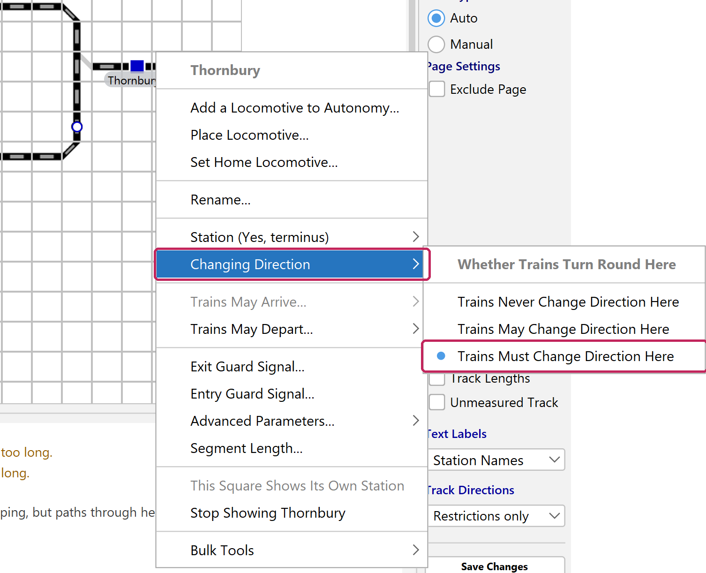

---

## Example 4: a through station that only takes trains one way

Some stations only make sense to arrive at from one direction. A platform on a one-way loop; a bay that faces east; a station where arriving from the west means fouling a junction.

Right-click the station and open **`Trains May Arrive...`**. By default a station accepts trains from every side. Untick the sides you do not want, and TrainControl will only route trains to it from the ones you left on. (The last open side cannot be unticked; a station with only one way in has nothing to choose.)

Set `Track Directions` to `Station Arrivals` to see, for every station at once, which sides it takes trains from.

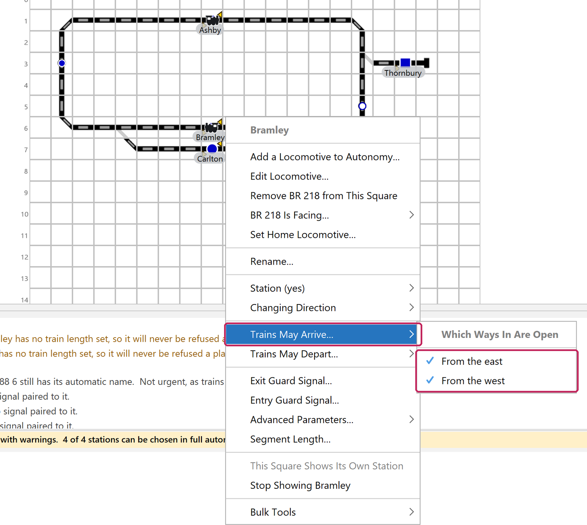

**Where this matters most** is a station that is really two platforms. On the diagram it is one square, but a train arriving from the east and a train arriving from the west are doing different things — different switches set, different track occupied. Arrival sides are how you say which of those you want.

---

## Track lengths: what they are for

Nothing above this line needs lengths. A layout with none set works, and TrainControl simply does not judge whether a train fits anywhere. Lengths only ever **refuse** — they are how you stop a train being sent somewhere it physically will not go, and how TrainControl knows that a long train standing at a short platform is hanging back over the track behind it.

**The unit is yours.** A length is a number, not centimetres. Pick something — a coach, a foot, ten centimetres — and use the same thing everywhere. All that matters is that a train's length and a track's length are counted in the same unit.

**Two different numbers, and they are easy to confuse.**

| | Where you set it | What it means |
| --- | --- | --- |
| A square's **segment length** | Right-click the square → `Segment Length...`, or Control+E with the pointer over it | How much train this piece of track physically holds |
| A station's **maximum train length** | Right-click the station → `Station (...)` → `Maximum Train Length`, or Control+B | The longest train you are willing to have stop here, whatever the track says |

The first is a measurement, the second is a preference. Both are checked and either can refuse. A train's own length is set with `Place Locomotive...` / `Edit Locomotive...`, or for every train at once with `Bulk Tools` → `Mass Assign Train Lengths (... missing)...`. Tick **Track Lengths** under `Visible Elements` to see the measurements on the diagram, and **Unmeasured Track** to see what is still missing; `Bulk Tools` → `Clear All Track Lengths` starts you over.

### What lengths govern

**Whether a train may be sent somewhere at all.** A train longer than the station's maximum is not sent there. A train longer than the measured track leading in is not sent there either, and the message says which of the two refused it.

**Whether a train would come to rest across a set of points.** This is the one that catches people out. The question is not "does the train fit between the two sensors" but "does it fit in the part after the last switch" — because a train standing on the points blocks every other road through them.

**How much track a standing train is actually occupying.** A train longer than its platform hangs back over the approach, across track that has no sensor of its own. TrainControl blocks that track, and draws it: the orange line on the diagram is as long as the train. Without lengths it cannot know, and two trains can be routed into the same piece of rail.

**Whether a train can go round a loop without running into its own tail.** A route that goes out round a loop and comes back along track the train is still lying on is allowed only if the back of the train has gone by the time the front gets there. When it is refused, the message says the longest train that would make it: "send a train of 9 units or shorter, or send this one another way".

Only measured track counts. With nothing measured round the loop, the trip is not checked at all. Where part of it has no length, the message says how many more lengths Mass Assign Lengths would ask you for on the way round. Give them, and the trip may turn out to be long enough.

**Which route is picked**, if you have chosen *Over the Shortest Track* or *Over the Longest Track*. Both are measured in your lengths, and a section with no length counts as one - so with nothing measured they pick the route over the fewest, or the most, sections. A section you answered 0 counts as 0.

### When to set them

Measure **the squares a train comes to rest on, and the run back to the switch behind each one**. That is the stretch the rules above ask about, but for one: **measure the track round any loop a train can be sent round and back onto its own line**, or that trip is not checked. Beyond that you do not have to measure the whole layout, and there is no benefit in measuring plain running line that nothing stops on.

**Example: a platform with points just behind it.** The run in from the previous sensor is 6, with a switch in the middle — 3 before it, 3 after.

- A **3-unit** train stops clear of the points. Nothing else on the layout is affected.
- A **6-unit** train fits the run in, but stands across the points. This is allowed at a station, because the train is passing through and will move on. While it is there, anything routed over those points is refused — so if they are the only way to another part of your layout, that part waits.
- A **7-unit** train is refused: it does not fit even the whole run in, so its back end would be somewhere nothing has been measured.

**Example: the same track, used as a parking berth.** A berth is somewhere a train *stays* — a station with **Can Be Chosen in Full Autonomy** unticked. Here the 6-unit train is refused, because its back end would sit on the points and shut that road for the rest of the session. A platform may be blocked for a minute; a siding would block it all evening.

> To park long trains, give the berth enough measured track **past** the switch behind it — or park them at a platform instead.

**Example: a platform you want to keep short trains at.** Your platform measures 8 and you never want more than 4 units there. Set its `Maximum Train Length` to 4. The measurement stays 8, because that is what says whether a train fits; the 4 is your preference on top.

### The one thing to watch

**Measure a whole run, or none of it.** An unmeasured square counts as nothing at all. A half-measured approach therefore understates how much room there is — which is safe, it refuses more than it needs to — but it also makes a *standing* train look longer than it is, because its back end runs over the unmeasured squares for free and blocks them too.

**Track that really has no length: answer 0.** Two sensors side by side have no track between them. Give that stretch 0 in Mass Assign Lengths or Segment Length - every square of it, a switch or crossing on it too - and it counts as measured track of no length: a train is let in wherever the measured track holds it in total, and a train standing there is taken to lie over the 0 and on behind it. A stretch left blank is still unmeasured, and still stops the count.

So if a short train seems to be blocking a surprising amount of track, the answer is almost always an unmeasured square behind it, not a fault. Set its length and watch the orange line shrink.

**The square a train is standing on is track, and it is spent first.** A 2-unit train on a platform square measured 2 fits on that square and blocks nothing behind it; a 3-unit train there lies one unit back over the track behind the platform, and that track is blocked. How long a train a station will take is a separate setting - its Maximum Train Length - and says only which trains may be sent there.

---

## Running and watching

**Starting and stopping.** `Start Autonomous Operation` is on the strip above the track diagram, on the right-click menu of the diagram, and on the Auto tab. `Graceful Stop` (`Gracefully Stop Autonomy` on the right-click menu) lets every train finish the route it is on and then stops. It is almost always what you want; the emergency stop is for emergencies. If no train can be started - each on a station out of service, or with no speed set - Start says so and comes straight back. The `Autonomy Controls` box on the strip shows or hides everything autonomy draws on the diagram.

**Stop before you quit.** Use `Graceful Stop`, wait for the trains to come to rest, then close TrainControl. Where every train stands is saved, and the same configuration loads next time. Closing while trains run leaves them moving with nothing to stop them, and TrainControl asks first.

**A train's route is drawn along the track.** The stations' blue for the track ahead of it, dark grey for the track it has driven and still holds, white arrows for which way it is going - and the train itself in orange along the length of track it covers, drawn over its route so its tail shows while it runs. Where routes are not atomic, the dark grey goes as the train gives the track behind it back. The line follows the track through curves and switches rather than cutting across them.

**Each train is drawn as a small locomotive** on its station, pointing the way it faces - whether or not autonomy is running - and on its route while it moves. A train standing still on a route it holds - while its switches are set, or held on its way - is drawn the same, where it stands.

**Station names are shown on the diagram.** In the editor, right-click a square beside a station and choose `Show a Station Name Here...` (or press Control+N over it); a station square shows its own name. `Text Labels` then chooses what every such caption shows: the station, the train parked there, or its home locomotive. A text label typed as `Point:StationName` that names a station the setup knows is taken over as a caption. To hide the names of stations autonomy will never send a train to, or to draw captions in blue rather than light grey, see **Preferences** → Autonomy.

**A signal paired with a station** (`Exit Guard Signal...`) goes red while a train is standing there, and green again once it leaves.

**While autonomy runs, nothing that changes the setup can be used.** The Autonomy and Layouts menus grey out whatever would change the setup or the track diagram, and say why when you hover over them; the Layouts menu keeps Open CS3 Web App, the pop-up pages and the picture export. On the Auto tab, the settings, `Execute Timetable` and `Capture Locomotive Commands` are greyed until the trains have stopped, saying "Please wait for all active locomotives to stop."

**The Auto tab** (the third icon on the left of the main window) is greyed until a configuration is loaded; when none is - after `Stop Using Autonomy`, or with `Load Autonomy` unticked under Preferences → Startup - the strip above the track diagram offers `Load this configuration`. Once one is loaded, the Auto tab has three tabs:

- **Autonomous Locomotive Commands** - `Start Autonomous Operation`, `Graceful Stop` and `Return Home`, and a card for each train saying where it is and where it can go. Double-click a destination to send the train there yourself. Hover over "No available paths" to see, for each station, why not - or click it for the whole list in a window. After a station's name, `*` marks the timetable's starting station and `-` one autonomy will never choose for that train; a train standing at its own home is shown in teal.
- **Timetable** - see [Timetables](#timetables-recording-a-sequence-and-playing-it-back).
- **Settings** - see [Settings](#settings-and-what-each-one-is-for).

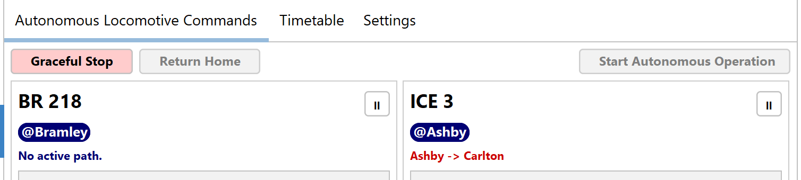

**On the track diagram**, right-click a train to send it to one of the stations autonomy chooses from, or one under `More Destinations` - the stations you have unticked `Can Be Chosen in Full Autonomy` on, such as parking berths. Right-click a station to place the train selected in the main window there (`Place` *train*), or to take one off. Placing a train from the diagram may ask which way it faces and which way it came in; if you are not sure, take the suggestion.

When you send a train that can reverse to a station where trains may change direction, TrainControl first asks "Keep direction?". Yes, the default, keeps it facing the way it is; No turns it round there.

The diagram's right-click `Autonomy Setup` menu has the same station settings as the editor, but changes made there are saved at once, with no Cancel. With autonomy stopped, you can also move trains from the keyboard: point at a station and press Control+X to pick its train up, Control+V to put it (or the locomotive selected in the main window) down, or Delete to take it off.

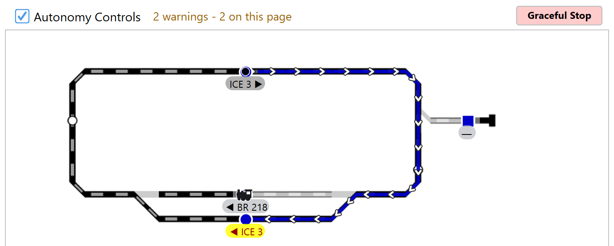

---

## Choosing how trains pick their route

When more than one route will do, TrainControl has to choose. The **Routing Logic** dropdown on the Auto tab's Settings (`Autonomy` → `Autonomy Settings...`) says how:

| Setting | What it does |
| --- | --- |
| At Random, Respecting Priority | Picks any of them, highest-priority stations first. This is the behaviour TrainControl has always had, and it stays the default |
| Completely at Random | Picks any of them, to any station - station priority is ignored |
| Past the Fewest Stations | The most direct route |
| Past the Most Stations | Trains call at things on the way rather than going straight there |
| Over the Shortest Track | By measured length; a section with no length counts as one, one answered 0 as 0 |
| Over the Longest Track | The scenic route |
| Across the Fewest Sensors | Fewest reporting points on the way |
| Across the Most Sensors | The busiest-looking route |
| Least Recently Visited | For a layout with a favourite loop, so the far corner still gets visited. Station priority still applies first |
| Weighing Station Priority Against Distance | The one rule that crosses priorities: a near ordinary station can beat a distant important one |

The "most" and "longest" settings exist for a layout that should look busy rather than efficient. On a small layout they are the difference between a train shuttling back and forth and a train that appears to be going somewhere.

The choice is saved with the autonomy configuration, so two configurations can use different rules. Stations you have marked as higher priority are chosen first under every rule except *Completely at Random*, which ignores priority, and *Weighing Station Priority Against Distance*, which trades it against how far away a station is.

---

## Timetables: recording a sequence and playing it back

Autonomy running on its own is random by design. A timetable is the opposite: a sequence you recorded once, played back the same way each time. It lives on the Auto tab's **Timetable** tab.

**To record one:** press `Capture Locomotive Commands`, then either start autonomy or send trains yourself. Every completed route is recorded, along with how long it was before the next one started. Press the button again to stop recording.

**To play it back:** press `Execute Timetable`. Each entry starts once the one before it has set off and the recorded pause has passed, and as soon as the track it needs is free. If that track stays blocked for a few minutes, the timetable stops and says which entry.

**To edit it:** right-click an entry for `Change Delay`, `Delete Entry`, `Restart Timetable` and `Clear Timetable`.

**Two things worth knowing.** Capture **appends** — recording again adds to what is already there rather than replacing it, so clear the timetable first if that is not what you want. And a timetable is recorded from a particular arrangement of trains: play it back with the trains somewhere else and the first entry will not run, because the train it names is not where it was. If an entry cannot be run, the timetable stops there and says which entry and why.

It is worth recording a timetable that ends where it began. That way it can be run again and again.

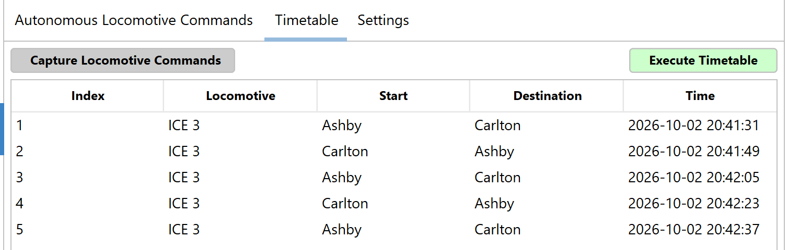

---

## Sending everything home

`Return Home` on the Auto tab - or `Return Locomotives Home` on the track diagram's right-click menu - sends every locomotive back to the station it belongs at. By default that is the station it was standing on when the configuration was loaded; you can say otherwise with a station's `Set Home Locomotive...` (Control+H), or for every train at once with `Bulk Tools` → `Home All Trains Where They Stand`.

Getting everyone home is rarely as simple as driving each train to its own station, because a station holds one train at a time — a train cannot go home while another is standing there. TrainControl works out an order that succeeds, moving trains out of each other's way and bringing them back afterwards where that is what it takes.

Trains must be stopped first, so use `Graceful Stop` if autonomy is running. The button is greyed when there is nothing to do, and its tooltip says why. If no arrangement can be found you are told so and nothing moves.

To see the homes on the diagram, set `Text Labels` to **Home Locs**: each station caption then names its home locomotive, in black when that locomotive is standing there and in white on dark grey when it is somewhere else. Return Home moves every white one - and also a train standing on its own home turned round, where the home was set facing a way, which the caption, comparing names only, draws in black.

---

## Settings, and what each one is for

These live on the Auto tab's **Settings** tab; `Autonomy` → `Autonomy Settings...` opens it. They are saved with the configuration. Most layouts need to change two or three of them at most, and none can be changed while trains are running.

| Setting | What it is for |
| --- | --- |
| Minimum and Maximum Action Delay | How long a train waits before leaving again, in seconds. A range rather than a number, so departures do not fall into lockstep |
| Default Locomotive Speed | Used for a locomotive with no preferred speed of its own |
| Pre-arrival Speed Multiplier | How much a train slows on the approach. This is what the sensor before the stopping point is for |
| Maximum Active Trains | How many run at once. Zero means as many as the track allows |
| Prioritize Locomotives After | A train that has not run for this many minutes is chosen first, so nothing sits forgotten. Zero is off |
| Maximum Network Latency | Cuts track power if the network to the Central Station gets too slow. Off by default |
| Atomic Routes | Whether a train reserves its whole route before setting off, or releases track behind it as it goes. Off is more capable and needs your lengths to be right, so it stays on while any track autonomy uses, or any train, has no length |
| Turn Off Functions on Arrival, Turn On Functions on Departure | On departure, switch on the locomotive's saved function preset (right-click the locomotive → `Save Current Functions as Preset`, or Alt+S); on arrival, switch all its functions off. Untick the arrival one to keep sound running between routes. Separately, one function can be toggled as each train leaves and one as it arrives, whatever these two say: right-click that function's button and tick `Autonomy Departure Function` or `Autonomy Arrival Function` |
| Routing Logic | See [Choosing how trains pick their route](#choosing-how-trains-pick-their-route) |
| Linked Routes | `Toggle specified routes`: whenever this configuration is loaded, and as soon as you tick a route, the routes ticked in the list are switched on and every other route is switched off, and they stay that way after autonomy stops - for emergency stops, sound effects, or safety signals. Only routes triggered by a sensor can be switched on this way |

Per-station settings - priority, speed, train length, excluded locomotives - are on the station's right-click menu, under `Station (...)` and `Advanced Parameters...`.

A few more autonomy settings are under Preferences → Autonomy, because they belong to this computer rather than to the configuration:

- `Path Integrity Validation` (on, and recommended) makes each train wait until the Central Station confirms every switch and signal on its route. If it cannot, the train does not leave, autonomy tries again, and a message names the accessories.
- `Display Travel Restrictions` and `Display Allowed Directions` draw the red and green direction marks on the ordinary track diagram.
- `Show Inactive Labels` and `Grey Station Labels` decide which station captions are shown and in what colour.

(`Simulate`, on the Settings tab, is only for testing without a Central Station.)

---

## Configurations: what each one keeps, and what they share

A configuration is one way of running your railway. They are all under the Autonomy menu:

- `Configuration (`*name*`)` lists them; pick one to load it. `Import…` brings one in from a file - including an `autonomy.json` from an older version - and `Export…` saves the one loaded.
- The first one is made with `Add a Configuration...`: no trains placed, every station rule and setting at its default, and no timetable.
- After that, `Manage Configurations…` → `New Configuration...` copies the one you have - its station rules, settings and speeds - and asks whether where the trains stand and the timetable come too. Answer No to start the copy with no trains placed and an empty timetable. The one you have stays chosen; pick the copy from the Autonomy menu when you want it. `Rename...` and `Delete` are beside it.
- Also under `Manage Configurations…`: `Stop Using Autonomy` unloads the configuration without deleting anything; `Delete This Layout’s Whole Autonomy Setup...` removes every configuration, with every station name, direction and caption - the track diagram itself is not touched. After `Stop Using Autonomy`, the strip above the diagram offers `Load this configuration`.
- `Pages with Autonomy Enabled…` says which pages autonomy uses.

None of these can be done while autonomy is running. The configuration you were last using is loaded when TrainControl starts, unless `Load Autonomy` is unticked under Preferences → Startup.

**Every configuration shares the railway itself:**

- which squares are stations, and their names and captions
- the direction of each piece of track, and its length
- the links between pages - which are paired, which are switched off, and their names
- which ways into a station are open, blocking stations, and signals
- which pages are in autonomy (`Pages with Autonomy Enabled…`)

Change any of these and every configuration sees the change.

**Each configuration keeps its own:**

- where each train stands, which way it faces, and the track it came in on
- whether trains may or must change direction at a station (`Changing Direction`)
- whether a station can be passed at all, whether full autonomy may choose it as a destination, and whether it is somewhere to park
- each station's home locomotive, longest train, priority, speed and the locomotives kept out of it
- the settings in the table above - including how trains pick their route - and the timetable

**So two configurations can run different railways on the same track.** Changing direction is part of how autonomy sees a station: where trains *may* change direction it adds a second copy of the station, with its own links, that trains turn round at; where they *must*, that copy replaces the one trains run through. A station that cannot be passed is not used at all. Two configurations can therefore offer different routes over the same track - but they cannot differ in the track itself, its directions, its links or which pages are in play: those belong to every configuration at once.

---

## When trains will not move

This is the section to read first when nothing happens. In rough order of how often each turns out to be the answer:

**The setup has an error.** Errors stop autonomy starting and stop trains being sent by hand; they are listed under **Must be fixed** in the editor, and clicking the count on the strip above the diagram opens the editor on the first one. See [The setup check](#the-setup-check).

**The track power is off.** Start, Execute Timetable, Return Home and every train you send by hand are refused until it is on: "To start autonomy, please turn the track power on, or cycle the power."

**The autonomy editor is open.** No train is sent while it is open. Save or Cancel first.

**Every station is occupied.** A station holds one train at a time, and a train can only go to a station that is free. On a layout with as many trains as stations, nothing can move. Take a train off, or add somewhere for one to go.

**The train has nowhere to go.** Look at the train's card on the Auto tab — it says so for each train in as many words. A train whose only destinations exclude it, or are the wrong direction, or are too short for it, has no route.

**The train is paused.** A train paused with the pause button on its card on the Auto tab is skipped by autonomy until you press the button again.

**Track that is needed is closed.** Closed track is marked on the diagram with `Track Directions` on `Restrictions only`, and a page link switched off with `Autonomy Uses This Link` is greyed. It is worth a glance along the route you expect the train to take - or ask `Test a path`.

**The destination is one autonomy may not choose.** A station with `Can Be Chosen in Full Autonomy` unticked is never chosen, and neither is a station where every train turns round, for a locomotive that cannot reverse. See [Example 3](#example-3-a-terminus-and-trains-that-must-turn-round). `More Destinations` on the train's right-click menu still takes a train to the first kind by hand.

**Maximum Active Trains is reached.** Autonomy starts no more trains until one arrives. Trains you send by hand do not count.

**Autonomy stopped by itself.** When a train fails part way along its route, it is stopped, its track is released, and autonomy stops, naming the train. Check where that train is really standing, and if TrainControl has it somewhere else, put it right before you start again. A train that has not reached its next sensor after five minutes is named in the log.

**The sensor is not reporting.** If TrainControl never sees the arrival, the train stays "running" forever and the track it holds is never released. Click the sensor square on the track diagram that the train was heading for: a left-click there switches the sensor as if the train had reached it, so TrainControl sees the arrival and the run carries on. Then find the faulty contact - watch its square while pushing a train over it by hand.

**The Central Station does not confirm the switches.** With `Path Integrity Validation` on (Preferences → Autonomy), a train whose switches and signals are not confirmed does not leave. Check the network connection to the Central Station.

**A switch or signal on the route is not in the database.** A route is not used if one of its accessories is missing, because the alternative is a train running over track that was never set.

**A train is standing somewhere in the way.** Not necessarily on the route itself — a train occupying a crossing or a shared block can hold up a route that merely passes nearby. A long train standing at a short platform reaches back further than it looks: the orange line on the diagram shows how far, and **[Track lengths](#track-lengths-what-they-are-for)** explains what to measure.

**The train is too long for everywhere it could go.** If you have set lengths, a train can run out of destinations simply by being long — the tooltip on "No available paths" says so for each station in turn. This is the rule doing its job, but it is worth checking the measurements are right before you shorten the train.

**It is facing a way that leads to no station autonomy may choose.** A train stood on a platform facing a way whose track leads only to sensors, turning points or parking is never sent anywhere by autonomy. Why not Moving? says so, and what would help:

- where the platform's other way leads to a station autonomy may choose, and a train may start from it: turn the train round;
- where the other way leads to one, but trains may not arrive at the platform facing that way: open that side under `Trains May Arrive...`, and turn the train round - unless every train turns round at that platform, where that side cannot be opened and the train is driven off by hand;
- where autonomy starts no train facing the other way for another reason: drive it off by hand;
- where neither way leads to a station autonomy may choose: drive it off by hand, or let autonomy choose a station it can reach - put that station back in service, tick `Can Be Chosen in Full Autonomy`, and open the side a train would arrive on under `Trains May Arrive...`, unless every train turns round there.

**Two places tell you which it is, rather than making you guess.** On the Auto tab, hover over "No available paths", or click it: it names every station the train might have been sent to and, for each one, the reason it was refused. In the editor, **Why not Moving?** answers the same question on the diagram - see [the tools](#the-tools-test-a-path-why-not-moving-one-way-run).

The log is verbose about all of this too, and worth reading: it names the train, the route, and the reason.
